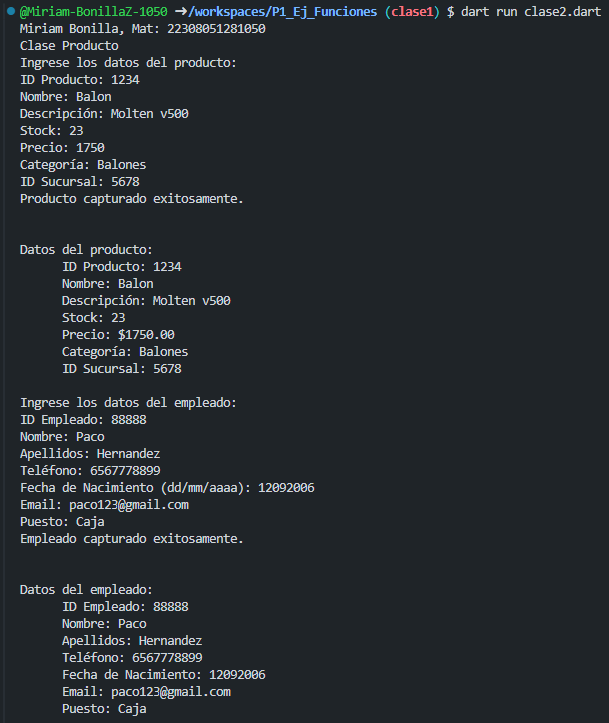
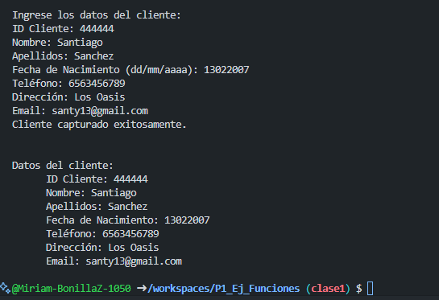

crear una clase "productos" de una tienda deportiva, con atributos (id_productos, nombre, descripcion, stock, precio, categoria, id_sucursal), con una funcion captura() desde la interfaz y otra funcion mostrar datos(). 

crear una clase "empleados" de una tienda deportiva, con atributos (id_empleados, nombre, apellidos, telefono, fecha de nacimiento, email, puesto), con una funcion captura() desde la interfaz y otra funcion mostrar datos().

crear una clase "clientes" de una tienda deportiva, con atributos (id_cliente, nombre, apellidos, fecha de nacimiento, telefono, direccion email, ), con una funcion captura() desde la interfaz y otra funcion mostrar datos().

