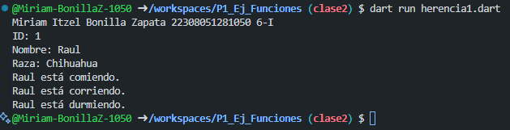

Crear una clase animal con los atributos (id_animal, conmbre y raza) y una funcion comer(). 
Crear otra clase perro con herencia animal con los fenomenos correr() y otra dormir(), lenguaje dart.

Salida de resultados:

