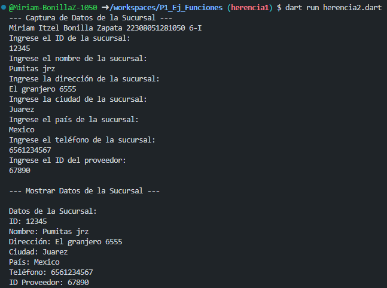
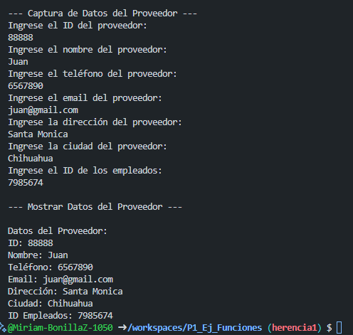

crear la clase Sucursal con los atributos (id_sucursal, nombre, direccion, ciudad, pais, telefono, id_proveedor) con una funcion capturadatos(), con interaccion de interfaz de usuario. Crear la clase DatosSucursal() con herencia Sucursal y una funcion mostrardatos().

crear otra clase proveedores  con los atributos (id_proveedor, nombre, telefono, email, direccion, ciudad, id_empleados) con una funcion capturadatos(), con interaccion de interfaz de usuario. Crear la clase DatosProductos con herencia Productos y una funcion mostrardatos(), lenguaje dart

Salida de resultados:

