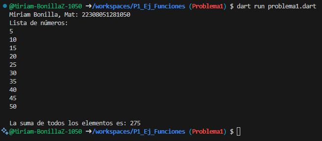
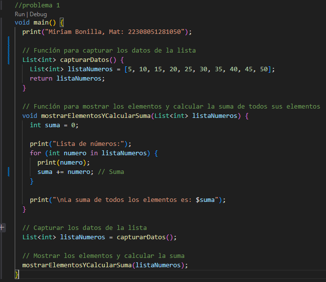

Escribe un programa que tome una lista de números enteros (int) 
y calcule la suma de todos sus elementos, que utilice 2 funciones
una para capturar datos de la lista y otra para mostrar los elementos.

Resultados: 

Codigo: 

